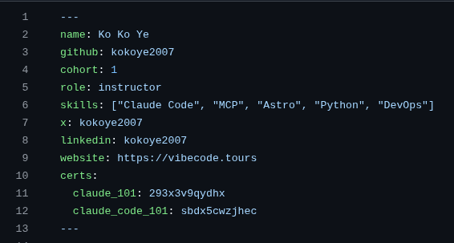

# Show your Claude Certifications 🎓

Finished **Claude 101** or **Claude Code 101** on Anthropic Skilljar? Add them to
your builder profile and they light up as amber badges on your card at
[vibecode.tours](https://vibecode.tours).

> Optional. Only add a cert you actually earned — each badge links to your public
> Skilljar verification.

---

## How to add (English)

1. Open your builder file: `src/content/builders/<your-github>.md`
2. Add a **`certs:`** block in the frontmatter (the `---` section at the top).
   The keys must be **indented under `certs:`** — not at the top level.

```yaml
certs:
  claude_101: https://verify.skilljar.com/c/XXXXXXXX
  claude_code_101: https://verify.skilljar.com/c/YYYYYYYY
```

3. Commit, push to your fork, open a Pull Request — same as your profile.

**We recommend the full verify URL** (so the badge links to your public proof).
The bare Skilljar code also works:

```yaml
certs:
  claude_101: XXXXXXXX          # bare code — also fine
```

### Where's my code / URL?
On your Skilljar certificate page → **Share / Verify** → copy the
`verify.skilljar.com/c/...` link. That whole link (or just the code at the end)
is the value.

### Known cert ids
`claude_101` · `claude_code_101` · `mcp_intro` · `agent_skills_intro` ·
`subagents_intro` · `claude_code_in_action` · `building_claude_api`

---

## How to add (မြန်မာ)

1. သင့် builder file ကို ဖွင့်ပါ: `src/content/builders/<သင့်-github>.md`
2. Frontmatter (အပေါ်ဆုံး `---` အပိုင်း) ထဲမှာ **`certs:`** block ထည့်ပါ။
   key တွေက **`certs:` အောက်မှာ indent (ကွက်လပ်ခြား) ထားရမယ်** — top level မှာ မထားရ။

```yaml
certs:
  claude_101: https://verify.skilljar.com/c/XXXXXXXX
  claude_code_101: https://verify.skilljar.com/c/YYYYYYYY
```

3. Commit လုပ်ပြီး သင့် fork ကို push၊ Pull Request ဖွင့်ပါ — profile တင်တဲ့အတိုင်းပဲ။

**verify URL အပြည့် သုံးဖို့ အကြံပြုတယ်** (badge က သင့်ရဲ့ public proof ကို link
ဖြစ်အောင်)။ bare code ပဲ ထည့်လည်း ရတယ်။

### code / URL ဘယ်မှာ ရမလဲ?
Skilljar certificate page → **Share / Verify** → `verify.skilljar.com/c/...`
link ကို copy ။ အဲ့ link အပြည့် (သို့) နောက်ဆုံးက code ကို value အဖြစ် ထည့်ပါ။

---

## What it looks like

**Your profile file (`.md`) — add the `certs:` block:**



**Your card on vibecode.tours — earned = amber, not-yet = grey:**


Earned certs glow amber and link to your verification. The **next 2 you haven't
earned yet** show as grey targets — your path forward. 🌟

---

⚠️ **Common mistake:** putting `claude_101:` at the **top level** (not under
`certs:`). It silently won't show. Always nest under `certs:`. The CI check now
warns you if you get this wrong.

Stuck? Ask in **#setup-help**.
